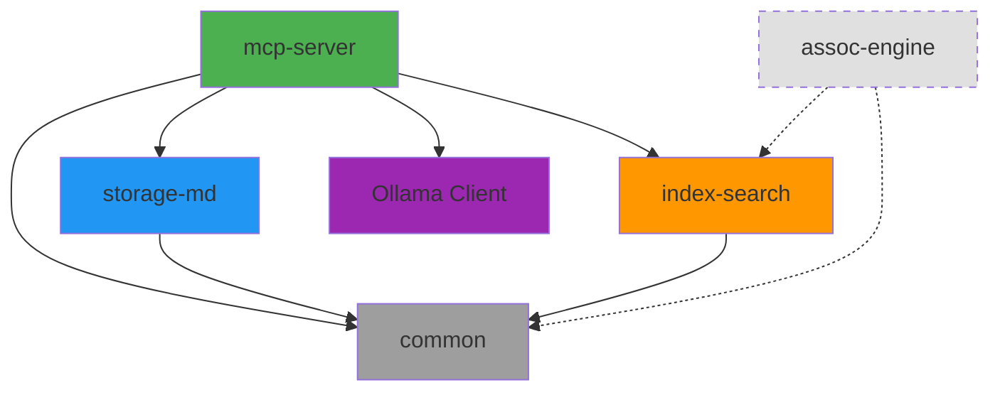
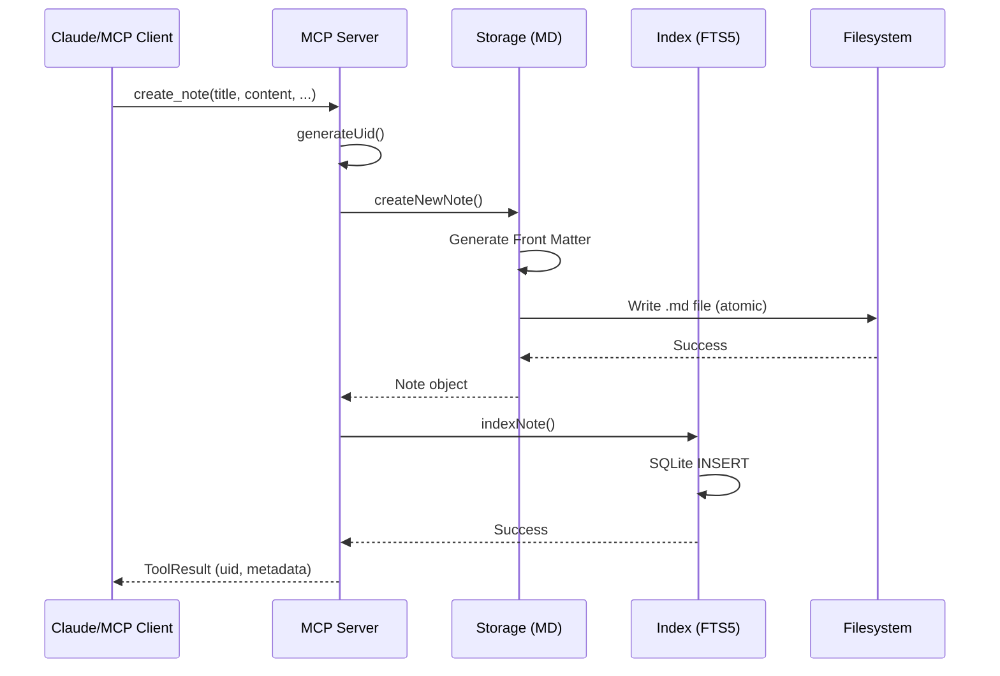
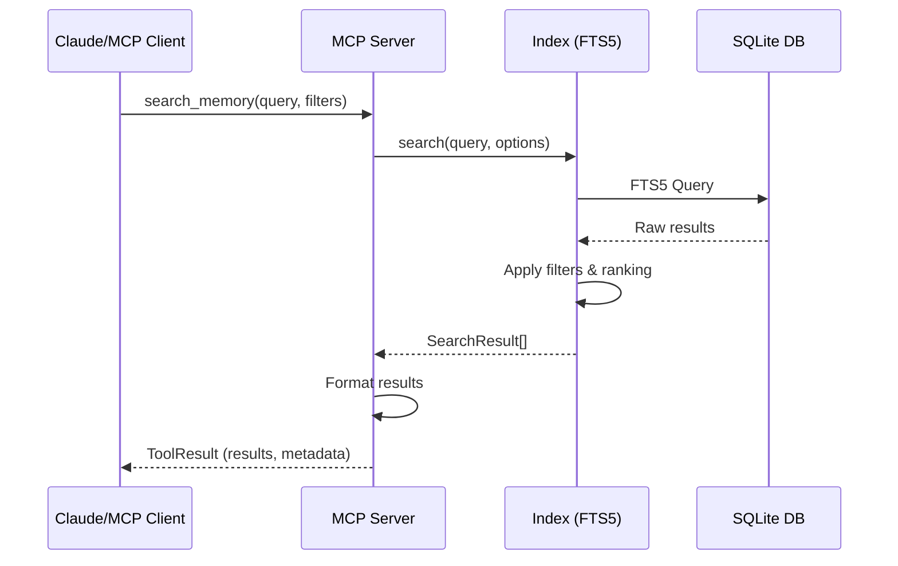
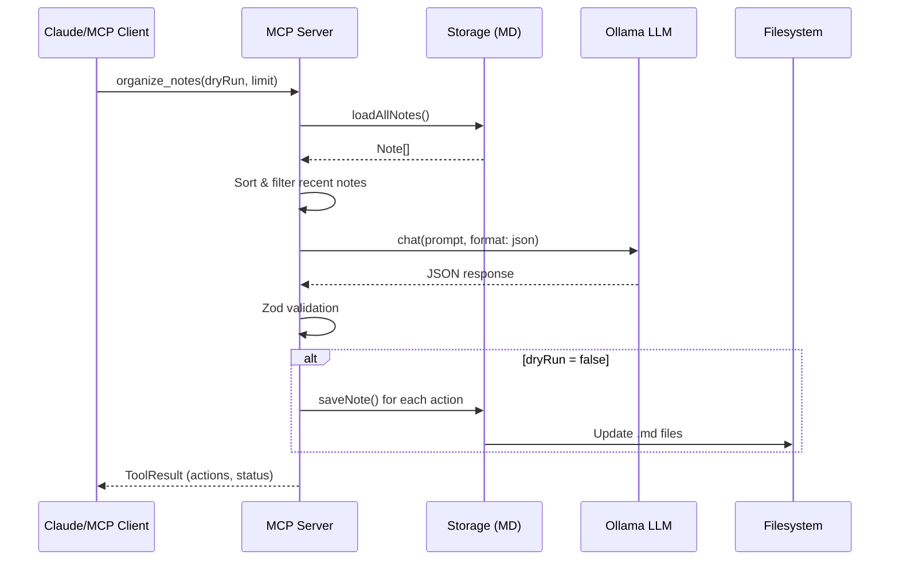
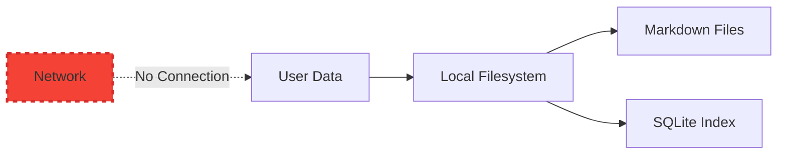
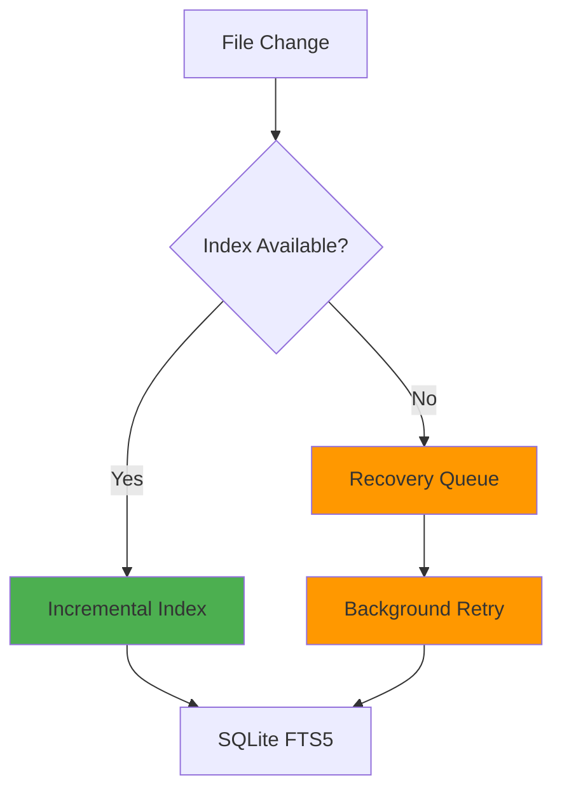
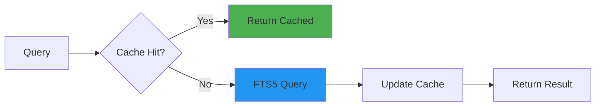
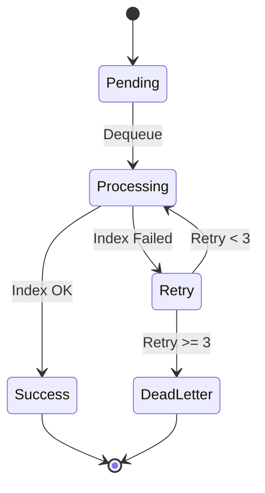
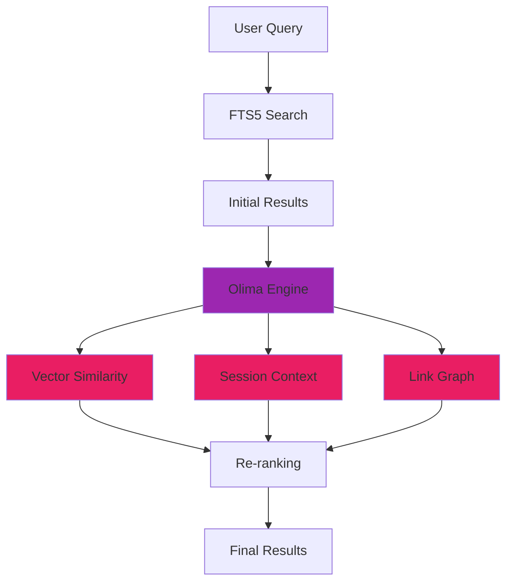

# Architecture

> **Memory MCP** 시스템 아키텍처 문서

---

## 📦 Package Structure

Memory MCP는 모노레포 구조로 다음과 같은 패키지로 구성됩니다:

```
zettel-memory/
├── packages/
│   ├── mcp-server/      # MCP 서버 & CLI
│   ├── storage-md/      # Markdown 저장소
│   ├── index-search/    # FTS5 검색 엔진
│   ├── assoc-engine/    # 연상 엔진 (v1.0.0+)
│   └── common/          # 공통 유틸리티
└── docs/                # 문서
```

---

## 🏗️ Package Dependencies



**범례**:
- **실선**: 현재 구현된 의존성
- **점선**: 계획된 의존성 (v1.0.0+)

---

## 🔄 Data Flow

### 1. Note Creation Flow



### 2. Search Flow



### 3. AI-Powered Organization Flow



---

## 🧩 Component Architecture

### MCP Server (`packages/mcp-server`)

```
mcp-server/
├── src/
│   ├── cli.ts                  # CLI entry point
│   ├── server.ts               # MCP server implementation
│   ├── ollama-client.ts        # Ollama LLM integration
│   └── tools/
│       ├── registry.ts         # Tool definitions & handlers
│       ├── schemas.ts          # Zod input schemas
│       ├── types.ts            # TypeScript types
│       ├── execution-policy.ts # Timeout & retry logic
│       ├── index-recovery.ts   # Index recovery queue
│       ├── metrics.ts          # Performance metrics
│       └── organize-notes.ts   # AI organization tool
```

**책임**:
- MCP 프로토콜 구현 (stdio 통신)
- 14개 도구 제공 (CRUD, 검색, 분석, 조직화)
- 에러 처리 및 재시도 정책
- Ollama 통합

### Storage (`packages/storage-md`)

```
storage-md/
├── src/
│   ├── note-manager.ts         # CRUD operations
│   ├── front-matter.ts         # YAML parsing & generation
│   ├── file-utils.ts           # Atomic write, sanitization
│   └── link-analyzer.ts        # Link graph analysis
```

**책임**:
- Markdown + YAML Front Matter 파싱/생성
- 원자적 파일 쓰기 (temp → rename)
- 링크 분석 (백링크, 깨진 링크)
- 파일명 sanitization

### Index Search (`packages/index-search`)

```
index-search/
├── src/
│   ├── fts-index.ts            # FTS5 wrapper
│   ├── search-engine.ts        # Search API
│   └── ranking.ts              # BM25 ranking
```

**책임**:
- SQLite FTS5 인덱스 관리
- 전문 검색 (키워드, 태그, 카테고리)
- BM25 기반 랭킹
- 증분 인덱싱

### Common (`packages/common`)

```
common/
├── src/
│   ├── types.ts                # Shared types
│   ├── errors.ts               # Error codes & classes
│   ├── logger.ts               # Structured logging
│   ├── uid.ts                  # UID generation
│   └── validation.ts           # Zod schemas
```

**책임**:
- 공통 타입 정의
- 에러 코드 체계
- 구조적 로깅
- UID 생성 (timestamp-based)

---

## 🔐 Security Architecture

### 1. Data Privacy



- **Local-First**: 모든 데이터는 로컬에만 저장
- **No Network**: 네트워크 송출 없음 (Ollama는 로컬 실행)
- **Atomic Writes**: 데이터 손실 방지

### 2. Sensitive Information Masking

```typescript
// packages/common/src/validation.ts
const SENSITIVE_PATTERNS = {
  email: /\b[A-Za-z0-9._%+-]+@[A-Za-z0-9.-]+\.[A-Z|a-z]{2,}\b/g,
  phone: /\b\d{3}[-.]?\d{3,4}[-.]?\d{4}\b/g,
  ssn: /\b\d{3}-\d{2}-\d{4}\b/g,
  // ...
};

function maskSensitiveInfo(text: string): string {
  // 정규식 기반 마스킹
}
```

---

## 📊 Performance Architecture

### Indexing Strategy



**성능 목표**:
- 검색 P95: < 120ms (실제: < 1ms ✅)
- 증분 인덱싱: < 3초
- 전체 인덱싱 (1만 노트): < 5분

### Caching Strategy (Future)



---

## 🔄 Error Handling & Recovery

### 1. Execution Policy

```typescript
// packages/mcp-server/src/tools/execution-policy.ts
interface ExecutionPolicy {
  timeout: number;        // 5000ms (default)
  retries: number;        // 2 (default)
  retryDelay: number;     // 1000ms
  backoff: 'linear' | 'exponential';
}
```

### 2. Index Recovery Queue



**특징**:
- 최대 3회 재시도
- 지수 백오프 (1s, 2s, 4s)
- Dead Letter Queue (영구 실패 작업)

---

## 🚀 Future Architecture (v1.0.0+)

### Olima Context-Aware Ranking Engine



**계획된 기능**:
- 벡터 임베딩 기반 유사도 검색
- 세션 문맥 기반 리랭킹
- 링크 그래프 분석 통합

---

## 📚 Related Documents

- [TECHNICAL_SPEC.md](./TECHNICAL_SPEC.md) - 기술 스택 및 KPI
- [DEVELOPMENT_GUIDELINES.md](./DEVELOPMENT_GUIDELINES.md) - 개발 원칙
- [VALIDATION_STRATEGY.md](./VALIDATION_STRATEGY.md) - 검증 전략
- [GOALS.md](./GOALS.md) - 프로젝트 목표

---

**Last Updated**: 2025-11-20  
**Version**: v0.0.1
