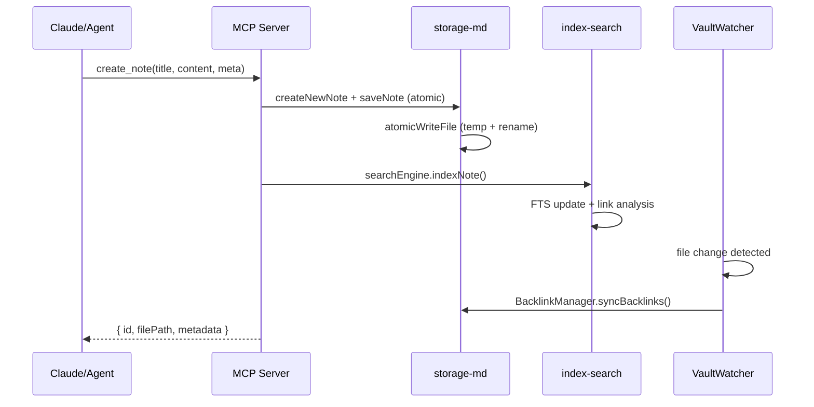
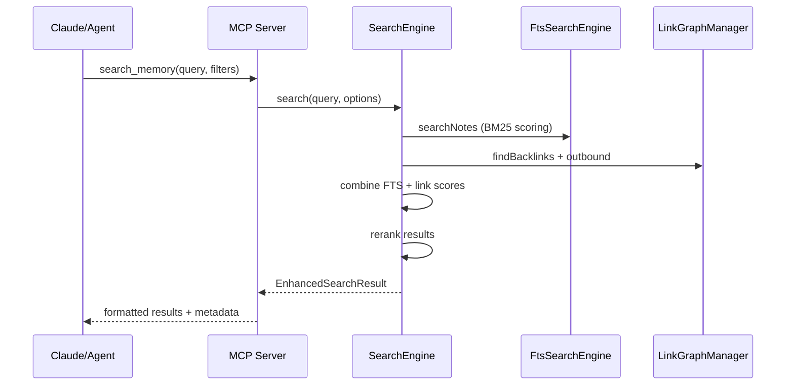
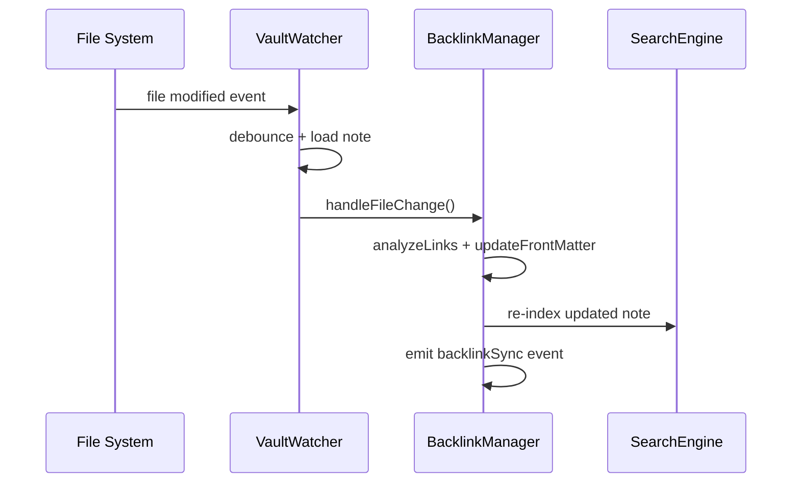

# 시스템 아키텍처

## 🏗 전체 구조(패키지)

```markdown
project/
├── packages/
│   ├── mcp-server/           # ✅ MCP 인터페이스/툴 노출
│   ├── storage-md/           # ✅ MD 저장/로드/Front Matter + 백링크/PARA 관리
│   ├── index-search/         # ✅ FTS/그래프 인덱싱 & 하이브리드 검색
│   ├── assoc-engine/         # 🔄 연상(Olima) 엔진 (기본 구조)
│   └── common/               # ✅ 스키마/유틸/로깅
└── docs/
```

### 📦 패키지별 구현 상태

#### ✅ **@memory-mcp/storage-md** (완료)
- **파일 운영**: 원자적 쓰기, 재시도, 경로 정규화
- **파일 감시**: chokidar 기반 실시간 변경 감지 (`VaultWatcher`)
- **백링크 관리**: 자동 파싱/갱신, 배치 처리 (`BacklinkManager`)
- **PARA 구조**: Projects/Areas/Resources/Archives 자동 관리 (`ParaManager`)
- **Front Matter**: Zod 스키마 검증, 직렬화/역직렬화

#### ✅ **@memory-mcp/index-search** (완료)
- **FTS 검색**: SQLite FTS5, 한글/영문 혼재, BM25 점수 (`FtsSearchEngine`)
- **링크 그래프**: 백링크/아웃바운드, 연결된 노트 탐색 (`LinkGraphManager`)
- **하이브리드 검색**: FTS + 링크 점수 결합 (`SearchEngine`)
- **데이터베이스**: WAL 모드, 마이그레이션, 최적화 (`DatabaseManager`)

#### ✅ **@memory-mcp/mcp-server** (완료)
- **MCP 프로토콜**: 표준 준수, 툴 레지스트리
- **검색 툴**: 실제 하이브리드 검색 수행 (`search_memory`)
- **노트 생성**: 자동 인덱싱 연동 (`create_note`)
- **CLI**: 헬스체크, 설정 관리

#### ✅ **@memory-mcp/assoc-engine** (완료)
- **Olima 로컬 런타임**: 외부 LLM 호출 없이 패키지에 포함된 연상 로직으로 동작
- **추천 로직**: FTS 점수 + 링크 그래프 + 태그/컨텍스트 가중치 결합
- **세션 상태 관리**: 로컬 메모리에 세션별 컨텍스트 저장 (TTL + 최대 히스토리)
- **리플렉션 빌더**: 노트 하이라이트 기반 요약 생성, 네트워크 의존성 없음

#### ✅ **@memory-mcp/common** (완료)
- **타입 시스템**: 공통 인터페이스, Zod 스키마
- **유틸리티**: 로깅, 마스킹, 에러 처리
- **링크 파싱**: 마크다운 링크 추출

## 🔄 주요 플로우 (실제 구현 기준)

**노트 생성 및 자동 인덱싱**


**하이브리드 검색**


**파일 변경 감지 및 백링크 동기화**


## 📁 데이터 모델 (Front Matter 예시)
```markdown
---
id: "20250927T103000Z"
title: "세션 요약: 인덱스 최적화 아이디어"
category: "Resources"   # PARA: Projects/Areas/Resources/Archives
tags: ["index", "fts5", "performance"]
project: "alpha-webapp" # 선택
created: "2025-09-27T10:30:00Z"
updated: "2025-09-27T10:30:00Z"
links: ["20250926T090000Z", "성능-튜닝-노트"]
---
```

## 🛠️ 핵심 기술 스택 (구현됨)

### 검색 및 인덱싱
- **SQLite FTS5**: 전문 검색, BM25 점수
- **WAL 모드**: 동시성 개선 및 성능 최적화
- **하이브리드 검색**: FTS(70%) + 링크 그래프(30%) 점수 결합

### 파일 시스템 관리
- **chokidar**: 실시간 파일 변경 감지
- **원자적 쓰기**: 임시 파일 + rename 전략
- **재시도 메커니즘**: 지수 백오프 with 일시적 오류 감지

### 데이터 처리
- **Zod**: 런타임 스키마 검증
- **gray-matter**: Markdown Front Matter 파싱
- **배치 처리**: 동시성 제한 및 메모리 최적화

### 백링크 및 관계 관리
- **자동 파싱**: 마크다운 링크 추출 및 관계 구축
- **실시간 동기화**: 파일 변경 시 백링크 자동 갱신
- **그래프 탐색**: 깊이 제한 연결 노트 탐색

## 🔐 보안 및 안정성
- **Local-first**: 기본적으로 외부 송출 차단
- **민감정보 마스킹**: 로그 및 응답에서 자동 마스킹
- **원자적 연산**: 데이터 손실 방지
- **오류 복구**: 포괄적인 예외 처리 및 재시도
- **타입 안전성**: TypeScript + Zod 런타임 검증
