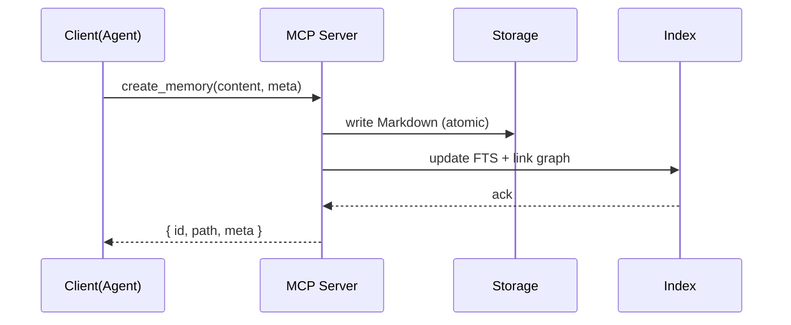
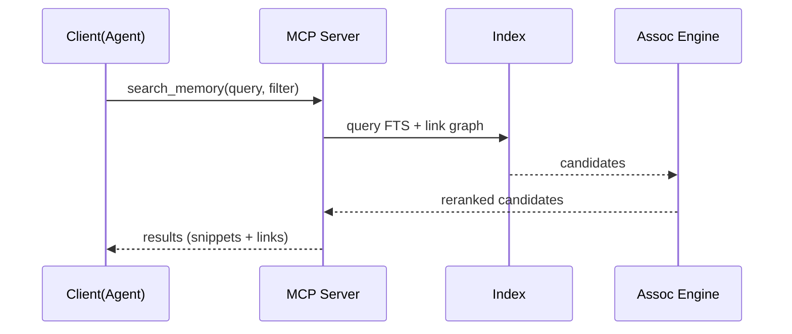

# 시스템 아키텍처

## 🏗 전체 구조(패키지)

```markdown
project/
├── packages/
│   ├── mcp-server/           # MCP 인터페이스/툴 노출
│   ├── storage-md/           # MD 저장/로드/Front Matter
│   ├── index-search/         # FTS/그래프 인덱싱 & 검색
│   ├── assoc-engine/         # 연상(Olima) 엔진
│   └── common/               # 스키마/유틸/로깅
└── docs/
```

## 🔄 주요 플로우 (Mermaid 시퀀스)

**메모리 생성**


**메모리 검색**


## 📁 데이터 모델 (Front Matter 예시)

### Schema v2 Features (v0.1.0+)
- **Optional PARA Category**: Supports Zettelkasten notes without category
- **Wiki-style Links**: Supports `[[link]]` and `[[link|display-text]]` syntax
- **Multiple Link Formats**: Both wiki links and standard markdown links

### Example: PARA Categorized Note
```markdown
---
id: "20250927T103000Z"
title: "세션 요약: 인덱스 최적화 아이디어"
category: "Resources"   # PARA: Projects/Areas/Resources/Archives (optional)
tags: ["index", "fts5", "performance"]
project: "alpha-webapp" # optional
created: "2025-09-27T10:30:00Z"
updated: "2025-09-27T10:30:00Z"
links: ["20250926T090000Z"]  # auto-detected from content
---

# Index Optimization Ideas

Referenced notes: [[20250926T090000Z]] and [[성능-튜닝-노트|Performance Tuning]]

See also: [Standard Link](https://example.com)
```

### Example: Zettelkasten Note (No Category)
```markdown
---
id: "20250927T150000Z"
title: "Atomic Note: Single Idea"
# category: omitted for Zettelkasten-style notes
tags: ["atomic", "zettelkasten"]
created: "2025-09-27T15:00:00Z"
updated: "2025-09-27T15:00:00Z"
links: []
---

This note follows Zettelkasten principles without PARA categorization.

Link to related: [[20250927T103000Z]]
```

## 🔐 보안 고려사항
- Local-first, 외부 송출 차단 기본값
- 민감정보 마스킹/필터
- 변경 이력(Git) 및 롤백 전략
